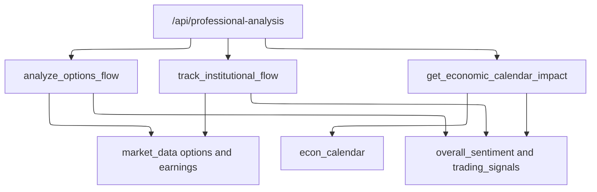

# Professional Analysis APIs

The dashboard has several symbol-level JSON APIs that provide supporting evidence beside the core [Rebound Score](../scoring/rebound-score.md). These APIs live in `app.py`, while their data is sourced from `market_data.py`, `sources.py`, `social.py`, and `econ_calendar.py`.

## API surface summary

| Route | Function | Returns |
| --- | --- | --- |
| `/api/social-sentiment/<symbol>` | `get_social_sentiment()` | Social sentiment payload from StockTwits and optional Reddit. |
| `/api/news-analysis/<symbol>` | `get_news_analysis()` | Recent headlines, fall-reason keyword classification, and analyst posture. |
| `/api/options-flow/<symbol>` | `get_options_flow()` | Options chain volume, put/call ratio, most active strikes, earnings timing, alerts. |
| `/api/institutional-flow/<symbol>` | `get_institutional_flow()` | Institutional ownership, top holders, FINRA short volume, Form 4 activity, solvency, explicit non-reported data. |
| `/api/economic-calendar/<symbol>` | `get_economic_calendar()` | Upcoming macro events, source availability, stock sector context, and volatility outlook. |
| `/api/professional-analysis/<symbol>` | `get_professional_analysis()` | Aggregates options, institutional, and macro APIs into one payload. |

All are rate-limited with `MAX_AI_REQUESTS_PER_MINUTE` and return source-aware unavailable states rather than fabricated neutral values.

## Social sentiment

`social.py` replaces invented social proxies with observed data:

- `stocktwits(symbol, company_name)` reads StockTwits stream messages, counts messages and sentiment-tagged bullish/bearish messages, and calculates `bearish_ratio` only when at least `MIN_TAGGED_MESSAGES = 5` are tagged. Fewer than five tagged messages is not converted into a calm or bullish score; `sentiment()` returns `overall.available = false` with the reason `not enough tagged messages to compute a ratio`.
- `reddit(symbol, company_name)` uses OAuth credentials from `secrets_store.get()` and searches configured subreddits. Its mention count is marked `capped` when the endpoint returns the maximum 100 results.
- `_phrases()` extracts repeated two- and three-word phrases from real text, removes cashtags/URLs, excludes stopwords and company-name/legal-entity phrases, and deduplicates overlapping phrases.
- `sentiment()` merges StockTwits and Reddit availability, phrases, and an overall label. Overall sentiment is unavailable when StockTwits lacks enough tagged messages.

`app.analyze_social_sentiment()` wraps this into the route payload, preserving source availability for each upstream.

## News and fall reason

`app.analyze_stock_news(symbol)` reads:

- `market_data.headlines(symbol, limit=5)`, which prefers Finnhub company-news and falls back to yfinance news.
- `market_data.analyst_recommendations(symbol)`, which prefers Finnhub recommendation trends and falls back to yfinance recommendations.

`classify_fall_reason(headlines)` performs display-only keyword matching over real headline text. Buckets include earnings miss, guidance cut, dilution/offering, analyst downgrade, legal/regulatory, and sector/market move. The classifier returns the matching keyword and says its basis is keyword matching; it does not influence score until enough snapshot evidence exists.

## Options flow

`app.analyze_options_flow(symbol)` wraps `market_data.options_flow()` and `market_data.earnings_date()`.

If options are unavailable, the payload has `available: false`, an empty metrics section, and a summary naming the failure reason. If available, it reports:

- Expiry, call volume, put volume, total option volume, listed contract count, and average volume per contract.
- Put/call ratio, open-interest put/call ratio, directional label, strength, color, and a note that the chain is positioning, not a directional forecast.
- Top active calls and puts.
- Earnings timing through `_earnings_block()`.
- Alerts for heavy call/put buying, large contract volume, and earnings within 14 days.

The underlying `market_data.options_flow()` requires real chain data or an Alpaca indicative fallback. The earlier constant “unusual activity” fallback is deliberately gone.

## Institutional flow

`app.track_institutional_flow(symbol)` reports what free data can support and explicitly names what it cannot:

- Institutional ownership percentage from yfinance profile. If Yahoo reports more than 100%, `market_data.profile()` wraps it as a derived caveat about share-lending double counting.
- Top 13F holders from `market_data.institutional_holders()`.
- Volume ratio from `market_data.technicals()`.
- FINRA daily short-sale volume from `market_data.finra_short_volume()`.
- SEC EDGAR Form 4 insider activity from `market_data.insider_filings()` including open-market buy/sell value where XML could be parsed.
- Solvency posture from `market_data.solvency()` using SEC XBRL where possible and yfinance fields as fallback.

The `not_reported` list explicitly excludes intraday institutional-vs-retail split, off-exchange/dark-pool volume as a live value, and execution quality because free sources do not provide them.

## Economic calendar

`econ_calendar.py` owns real scheduled-event collection with a small in-memory cache. Successful FOMC parses use `TTL_FOMC = 7 * 24 * 60 * 60`; successful FRED release calendars use `TTL_FRED = 24 * 60 * 60`; failed scrapes/API reads use `TTL_FAILED = 15 * 60`, so bad upstream state retries soon instead of staying pinned.

- `fomc_meetings()` scrapes the Federal Reserve FOMC calendar, verifies plausible meeting counts, and caches for a week.
- `fred_releases(days_ahead)` reads CPI, Employment Situation, GDP, and Retail Sales release dates from FRED when `FRED_API_KEY` exists; otherwise it returns unavailable.
- `upcoming_events(days_ahead)` merges source successes and unavailable reasons into one sorted list with `events`, `sources`, `unavailable`, `horizon_days`, `available`, and `as_of`. A missing FRED key or failed FOMC scrape is carried in `unavailable` rather than replaced by guessed dates.

`app.get_economic_calendar_impact(symbol)` adds the stock sector from `market_data.profile(symbol)['sector']`, computes `volatility_outlook` from the number of high-impact events, and includes unavailable-source warnings in `trading_considerations`.

## Aggregate professional analysis

`/api/professional-analysis/<symbol>` composes:

- `options_flow`
- `institutional_flow`
- `economic_calendar`

It then derives `overall_sentiment` from nested availability-safe fields and concatenates alerts/signals/considerations into `trading_signals`. Each child subsystem may be unavailable independently.



This diagram shows the aggregate endpoint composition and its downstream dependencies.

## Tests and validation

- `tests/test_no_fabrication.py::TestPhraseExtraction` covers social phrase extraction.
- `tests/test_market_context.py::TestImpliedMove` covers options/implied-move semantics.
- `tests/test_market_context.py::TestGoingConcern` and `tests/test_gold_standard.py` cover EDGAR filings, XBRL facts, and no-clear-on-failure behavior.
- `tests/test_sources.py` covers earnings, grades, splits, price failover, and provider-budget safety.

Minimal validation:

```bash
python -m pytest tests/test_no_fabrication.py tests/test_market_context.py tests/test_gold_standard.py tests/test_sources.py -q
```
