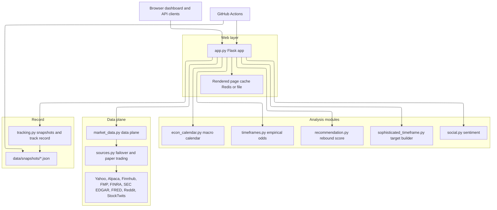
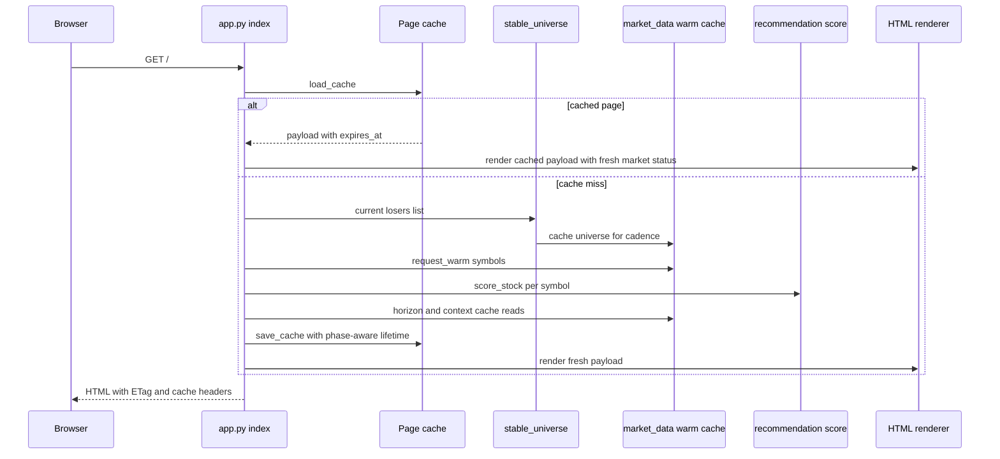

# Yahoo Losers Webapp Architecture

This repository is a single-service Python web application for a Yahoo Finance daily-losers dashboard. The runtime entrypoint is `app:app` in `app.py`, served by Gunicorn through `gunicorn.conf.py`, `Procfile`, or `Dockerfile`. The application combines a product-defining losers universe, cached market data, multi-provider fallbacks, six-factor rebound scoring, empirical target-hit odds, optional paper-trading execution, and a committed snapshot record.

## Runtime component map

This diagram shows the runtime ownership boundaries and the major data flows inspected in `app.py`, `market_data.py`, `sources.py`, and `.github/workflows/snapshot.yml`.

## Primary request path

The homepage route `index()` is the central orchestration path:

1. `load_cache()` tries the rendered-page cache from Redis (`REDIS_URL`) and then `/tmp/yahoo_finance_cache.pkl`.
2. On a miss, `stable_universe()` returns one consistent daily-losers universe for the render cadence. It scrapes Yahoo's `day_losers` screener first, then uses `sources.alpaca_losers()` and `sources.fmp_losers()` if Yahoo fails.
3. `get_stock_details()` queues `market_data.request_warm(symbols)` and fetches current quote/chart details concurrently for table display.
4. `calculate_enhanced_investment_analysis()` combines basic price/target columns with `score_stock()`, horizon odds from `_horizon_summaries()`, sector context, analyst revisions, going-concern and earnings chips, liquidity, and `_composite_rank()`.
5. `filter_ai_recovery_potential()` keeps only genuinely scored rows above `MIN_REBOUND_SCORE` and sorts by the same composite-rank philosophy as the main board.
6. `degraded_state()` can mark the page short-lived and display a banner when few rows score or a factor is missing board-wide.
7. `save_cache()` writes the page payload with an absolute expiry; `format_results_as_html()` renders the single-file template string.

The sequence is important: the render path is intended to use warmed data where possible, while the background lanes refill caches outside the user-visible path.

## Data plane and provider strategy

`market_data.py` is the central data plane. It owns:

- `TTLCache`, backed by Redis when reachable and by a process-local dictionary otherwise.
- Disk persistence through `MARKET_DATA_CACHE_FILE`, used to restore positive cache entries across restarts.
- Market-phase-aware TTL stretching through `market_phase()` and `_effective_ttl()`.
- Shared provider throttling (`_throttle()`), a separate adaptive `.info` lane throttle, and an options endpoint cooldown.
- yfinance-based producers for target/quoteSummary fields, profile, earnings, news, recommendations, options chains, implied move, history, OHLCV, SEC EDGAR, FRED, FINRA short volume, and institutional holders.
- Background warmers: a fast lane for batched histories, indices, FRED, latest bars, and a slow lane for profile, ratings/options, grades, earnings, EDGAR, target, and short-interest fallback caches.

`sources.py` is the non-Yahoo provider layer. It contains Alpaca, Finnhub, FMP, FINRA, and Alpaca paper-account integrations. It is also the safety boundary for paper-vs-live trading and for scarce provider budgets. See [Provider Failover](../data/provider-failover.md) and [Market Data Cache and Warmers](../data/market-data-cache-and-warmers.md).

## Scoring and prediction layers

There are two related but distinct scoring concepts:

- [Rebound Score](../scoring/rebound-score.md) is the production board and recommendation score. `recommendation.score_rebound()` combines six observable factors and refuses to score below three available inputs.
- [Empirical Odds and Timeframes](../scoring/empirical-odds-and-timeframes.md) describes target-hit probabilities. `timeframes.py` measures historical hit rates, while `SophisticatedTimeframePredictor` builds short/medium target levels and app code attaches measured probabilities.

The board's default ordering uses `_composite_rank()`, not the raw rebound score alone. It blends setup score, short-horizon bounce odds, and downside shape with missing components imputed neutral rather than renormalized.

## Tracking, calibration, and trading loop

`tracking.py` turns daily snapshots into a public track record, probability calibration, and live-readiness gate. `.github/workflows/snapshot.yml` calls `/api/snapshot` after the extended session, verifies at least one scored row, writes `data/snapshots/<date>.json`, and opens a daily digest issue. The snapshot route also invokes `sources.paper_manage_positions()` before `sources.paper_execute_picks()` so existing risk is handled before new entries.

The trading path is paper-only by default. `sources._alpaca_trading_base()` refuses non-paper endpoints unless all explicit live arming conditions pass: exact `LIVE_TRADING_ARMED` phrase, live Alpaca credentials, and `tracking.live_readiness()` success. See [Paper Trading and Live Gate](../trading/paper-trading-and-live-gate.md).

## Public surfaces

Major user-visible surfaces are documented in [Dashboard and Routes](../application/dashboard-and-routes.md):

- HTML: `/`, `/track-record`, `/methodology`, `/inspect/<symbol>`.
- Exports and health: `/export/csv`, `/health`, `/health/sources`, `/metrics`, `/refresh`, `/sw.js`.
- APIs: `/api/snapshot`, `/api/recovery-prediction/<symbol>`, `/api/sophisticated-timeframe/<symbol>`, `/api/social-sentiment/<symbol>`, `/api/news-analysis/<symbol>`, `/api/options-flow/<symbol>`, `/api/institutional-flow/<symbol>`, `/api/economic-calendar/<symbol>`, `/api/professional-analysis/<symbol>`, `/api/ai-analysis/<symbol>`, task and client-error endpoints.

## Operational surfaces

Deployment is conventional for a Python web service:

- `Dockerfile` builds Python 3.9 slim, installs `requirements.txt`, runs as a non-root user, exposes 8080, and starts `gunicorn -c gunicorn.conf.py app:app`.
- `gunicorn.conf.py` uses 2 `gthread` workers, 4 threads, `preload_app = True`, and a 120-second timeout.
- `docker-compose.yml` runs Redis, app, NGINX, and optional Prometheus; `docker-compose.scale.yml` adds app replicas and cAdvisor.
- `nginx.conf` load-balances to `app:8080`, limits `/api/` more tightly than general traffic, caches static assets, and restricts `/metrics` to private networks.
- `k8s-deployment.yaml` defines a Deployment, LoadBalancer Service, HPA, Redis Deployment, and Redis Service.
- GitHub Actions run offline tests, dependency audit, secret scanning, health-watch, nightly snapshot, and wiki maintenance.

## System invariants

- Missing provider data is not replaced with a number; it is represented by `Sourced.unavailable()` and usually displayed as `—`.
- Provider failures keep cause identity so transient outages do not become long-lived structural negatives.
- Render paths should be cache-first or cache-only for slow signals; warmers do provider work in paced lanes.
- Yahoo is primary only where it defines the product or has richer/batched data; keyed providers are budgeted and day-claimed.
- A live-money endpoint cannot be reached accidentally; paper trading is the default and only self-serve path.
- Predictions and picks are recorded before being judged; track record and calibration derive from committed snapshots, not retrospective reconstruction.

## Where to go next

- Change a route or page: [Dashboard and Routes](../application/dashboard-and-routes.md).
- Add or adjust market data: [Market Data Cache and Warmers](../data/market-data-cache-and-warmers.md) and [Provider Failover](../data/provider-failover.md).
- Change scoring: [Rebound Score](../scoring/rebound-score.md) and [Empirical Odds and Timeframes](../scoring/empirical-odds-and-timeframes.md).
- Change trading behavior: [Paper Trading and Live Gate](../trading/paper-trading-and-live-gate.md).
- Validate changes: [Testing Strategy and Fixtures](../testing/strategy-and-fixtures.md) and [Source Map](../source-map.md).
