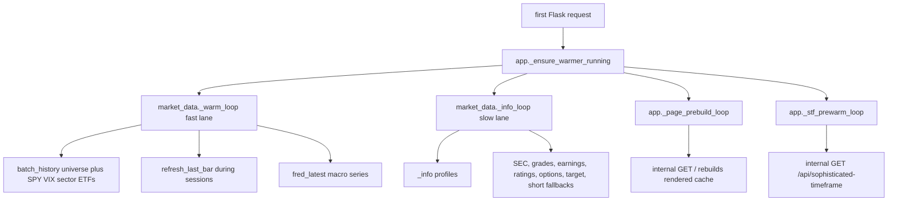

# Market Data Cache and Background Warmers

`market_data.py` is the repository's central data plane. It hides provider latency behind cache reads, coordinates provider throttles, stretches TTLs by market phase, persists hot positive cache entries to disk, and runs background warmers so the dashboard can render without expensive provider calls.

For provider-specific fallback chains, see [Provider Failover](provider-failover.md). For missing-value semantics, see [Data Provenance and No-Fabrication Contract](provenance-and-honesty.md).

## Cache layers

`TTLCache` has two storage modes:

- Redis when `REDIS_URL` is reachable. Keys are namespaced with `md:{CACHE_SCHEMA_VERSION}:` so shape changes can invalidate old entries.
- A process-local dictionary when Redis is unavailable or disabled after three consecutive Redis failures.

`_load_cache_from_disk()` restores unexpired local entries from `MARKET_DATA_CACHE_FILE` at import. `save_cache_to_disk()` writes only successful dict payloads and replaces the file atomically through a temporary file.

`claim_once(key, ttl)` is a critical extension: it uses Redis `SET NX` where available and a local lock otherwise. `sources.py` uses it to prevent duplicate same-day FMP/FINRA spending.

## TTL and failure policy

Base TTLs in `market_data.py` are field-specific:

| TTL | Used for |
| --- | --- |
| `TTL_QUOTE` | current quote-like data |
| `TTL_TECHNICALS` | price history-derived indicators and history refreshes |
| `TTL_OPTIONS` | option chain and implied-move data |
| `TTL_NEWS` | headlines |
| `TTL_EARNINGS` | earnings dates |
| `TTL_TARGETS` | analyst targets and rating data |
| `TTL_PROFILE` | company profile and holder-style fields |
| `TTL_NEGATIVE_TRANSIENT` | ordinary fetch failures |
| `TTL_NEGATIVE_STRUCTURAL` | confirmed security-level absences |
| `TTL_RATE_LIMITED` | rate-limit failures |

`_effective_ttl()` stretches TTLs outside the regular session using `PHASE_TTL_STRETCH`; pre-market and after-hours stretch less than the closed phase because prices and analyst updates can still move. Jitter is upward-only to avoid stampedes without shortening long-lived entries.

`_cached()` implements the common producer wrapper. It retries one time for transient failures, classifies rate-limit strings, requires a separate candidate interval before treating structural absences as long-lived, and returns a dict payload that callers convert into `Sourced` objects. Its TTL branches are: successes use `_effective_ttl(ttl)`; `reason` containing `cooling down` uses a short 90-second retry; rate-limit details use `TTL_RATE_LIMITED`; first structural-looking absences create `negcand:<key>` and cache the main negative for five minutes; a later matching structural absence at least four minutes after the candidate promotes to the longer structural TTL; all other failures use `TTL_NEGATIVE_TRANSIENT`.

## Market phase and injected dependencies

`market_phase()` returns `open`, `pre_market`, `after_hours`, or `closed` plus `changes_at`, based on the Eastern clock. `app.py` injects `sources.trading_days_set(cache_only=True)` through `set_trading_days_source()` so holidays can read as closed without a provider fetch on every hot path. If the calendar is missing, weekday logic is the fallback.

`app.py` also injects an Alpaca quote failover with `set_price_failover()`. `refresh_last_bar()` calls it only when the Yahoo batched download returns no data and only patches cached bars for the same session date.

## Data producers owned here

Important public producers and their outputs:

- `_info()` wraps yfinance `.info` and caches target, profile, short-interest, ownership, balance-sheet, price, and sector fields together.
- `analyst_target()` requires a consensus count of at least `MIN_ANALYSTS_FOR_CONSENSUS`; FMP can fill mean/count when Yahoo lacks them.
- `profile()` exposes name, sector, industry, short percent float, institutional holding percentage, and average volume; it uses FINRA/FMP and Finnhub profile fallbacks where appropriate.
- `earnings_date()` distinguishes confirmed dates from estimated Yahoo ranges and labels past dates as `Last reported`.
- `headlines()` prefers Finnhub company news, then yfinance news.
- `analyst_recommendations()` prefers Finnhub recommendation trends, then yfinance recommendations.
- `options_flow()` reads yfinance option chains and falls back to Alpaca indicative snapshots.
- `implied_move()` derives an ATM straddle implied move and labels quote quality.
- `technicals()` computes RSI-14, Bollinger `%B`, 20-day MA gap, volume ratio, 6-month drawdown, and close from real daily OHLCV.
- `price_history()` and `ohlcv_history()` supply split-adjusted close arrays and serialized OHLCV frames for [Empirical Odds and Timeframes](../scoring/empirical-odds-and-timeframes.md).
- `finra_short_volume()`, `insider_filings()`, `sec_fundamentals()`, `solvency()`, `sector_context()`, `fred_latest()`, and `institutional_holders()` supply professional analysis and context chips.

## Warmers



This diagram shows all background threads and their main responsibilities.

The warmer starts from `app._ensure_warmer_running()` rather than at import because Gunicorn uses `preload_app = True`; import happens in the master and threads would not be inherited across fork. `market_data._warmer_started` and `MARKET_DATA_DISABLE_WARMER` gate startup.

### Fast lane

`request_warm(symbols)` never fetches. Under `_warm_queue_lock`, it uppercases each symbol and appends it only when the symbol is not already queued and its `info:<SYMBOL>` cache entry is absent. This makes page render enqueue work without blocking.

`_warm_loop()` is intentionally independent from the slow info lane. It:

- Pulls symbols from the app-injected `_symbol_source` when the queue is empty.
- Observes `_warm_backoff_until` after rate-limit failures.
- Uses `_holds_warm_lease()` to avoid duplicate warming across Gunicorn workers when Redis exists.
- Refreshes `^VIX`, `SPY`, sector ETF histories, and FRED macro series each cycle.
- Runs `batch_history(universe)` for the current losers list.
- Calls `refresh_last_bar()` during non-closed phases on its own `PRICE_REFRESH_SECONDS` cadence.
- Persists cache state after index/macro and universe refresh work.

### Slow info lane

`_info_loop()` drains work that would otherwise slow or rate-limit the render path:

- Profiles through `_info()` at an adaptive `.info` pace.
- SEC going-concern flags.
- Analyst grades and confirmed earnings through `sources.py`.
- Ratings and options factor caches.
- FMP target and FINRA/FMP short-interest fallbacks when Yahoo cannot provide them.
- Trading calendar cache warming.

The adaptive `.info` lane doubles its interval on refusals and decays toward the base interval on success. Options have a separate all-symbol cooldown so the prewarmer cannot hammer chain endpoints symbol by symbol.

## Batch history and latest-bar refresh

`batch_history(symbols, period='5y')` is the heavy-history path. It uses `yf.download()` once for a symbol batch, populating:

- `hist:{symbol}:5y` for close arrays used by odds and calibration.
- `ohlcv:{symbol}:1y` for highs, lows, volumes, liquidity, and timeframe contexts.
- `tech:{symbol}` for the six-factor score.

`refresh_last_bar(symbols)` is the light same-session patch path. It downloads only the last five days, replaces or appends the final daily bar, recomputes technicals, and can patch same-session close values from an injected Alpaca latest-trade failover if Yahoo returns nothing.

## Tests and validation

Focused tests:

- `tests/test_freshness.py::TestRefreshLastBar.test_same_day_replaces_never_duplicates`, `test_new_day_appends_and_recomputes`, `test_cold_caches_are_skipped_not_crashed`, and `test_rate_limit_engages_backoff` verify append/replace semantics, cold-cache skips, and backoff.
- `tests/test_freshness.py::TestPagePrebuildPolicy.test_near_expiry_needs_build` and `test_redis_load_carries_deadline` verify prebuild timing and Redis expiry propagation.
- `tests/test_no_fabrication.py::TestCacheLifetimes.test_closed_market_extends_lifetime` covers market-phase TTL stretching, `tests/test_no_fabrication.py::TestCacheLifetimes.test_info_ttl_jitter_spreads_the_herd` covers info TTL jitter, and `tests/test_sources.py::TestCacheContracts.test_effective_ttl_jitter_never_dips_below_base` covers upward-only jitter.
- `tests/test_no_fabrication.py::TestCacheRecovery.test_failures_are_not_persisted_to_disk` verifies disk persistence excludes failed payloads.
- `tests/test_no_fabrication.py::TestCacheRecovery.test_clear_cache_empties_everything` verifies `market_data.clear_cache()` clears cache state.
- `tests/test_sources.py::TestCacheContracts.test_claim_once_is_single_winner` covers atomic claim markers.
- `tests/test_no_fabrication.py::TestRenderPathMakesNoProviderCalls.test_request_warm_queues_without_fetching` verifies `request_warm()` enqueues symbols without doing provider work.
- `tests/test_no_fabrication.py::TestLaneIndependence.test_both_lanes_start` verifies fast and slow warmer threads start separately.
- `tests/test_sources.py::TestCalendar` checks exchange-calendar injection and cache-only hot paths.
- `tests/test_market_context.py` covers cache-only EDGAR render paths and implied move safeguards.

Minimal validation:

```bash
python -m pytest tests/test_freshness.py tests/test_no_fabrication.py tests/test_sources.py -q
```
