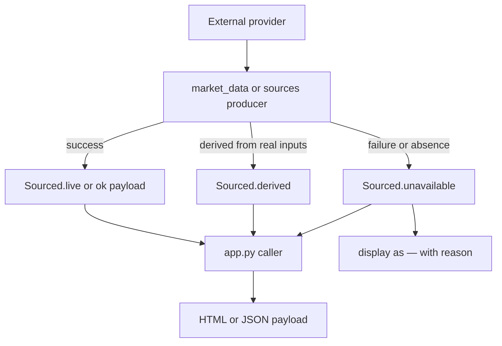

# Data Provenance and No-Fabrication Contract

The central product rule is: **if a value cannot be sourced, do not invent a substitute**. The implementation exists because older versions replaced missing market data with formulas such as synthetic price targets or neutral sentiment/option values. The current code makes missingness explicit through `provenance.Sourced`, unavailable display values, cache failure classification, and tests that guard known fabrication patterns.

This contract is the foundation for [Provider Failover](provider-failover.md), [Rebound Score](../scoring/rebound-score.md), [Professional Analysis APIs](../analysis/professional-analysis-apis.md), and [Snapshots, Track Record, and Calibration](../tracking/snapshots-track-record-and-calibration.md).

## Core primitives

`provenance.py` owns the primitive value wrapper:

| Symbol | Responsibility | Important behavior |
| --- | --- | --- |
| `UNAVAILABLE_DISPLAY = "—"` | UI representation for absent financial values. | Never a numeric-looking placeholder. |
| `Sourced.live(value, source)` | Marks a value fetched directly from a provider. | Sets `ok=True`, current UTC `as_of`, and no reason. |
| `Sourced.derived(value, source)` | Marks a value computed from real inputs. | Prefixes source with `derived:` so UI/API consumers can distinguish it from reported data. |
| `Sourced.unavailable(source, reason)` | Marks a failed or unavailable value. | Sets `value=None`, `ok=False`, and preserves a human-readable reason. |
| `Sourced.format()` | Display renderer. | Returns `—` whenever `ok` is false or value is `None`; only real values are formatted with prefixes/suffixes. |
| `safe_ratio()` | Division helper for optional denominators. | Returns `None` or the caller's default on zero/missing denominator instead of throwing or inventing. |
| `redact_secrets()` | Sanitizes provider exception text. | Replaces `apikey=` and `token=` query parameter values with `REDACTED`; `market_data._cached()` applies it to every not-ok `reason` and `detail` payload before cache storage. |

## How the contract travels through the app

The diagram captures the non-fabrication lifecycle: providers may fail, but a failed fetch becomes a source-labeled absence, not a number.

## Call-site responsibilities

Callers must check `ok` before trusting `.value`. Common patterns:

- `get_stock_details()` formats analyst targets with `Sourced.format('.2f', prefix='$')`; unavailable targets render as `—` and preserve a `Price Target Source` reason.
- `calculate_ai_rebound_prediction()` returns a `scored: false` payload when `score_stock()` cannot gather enough inputs.
- `analyze_options_flow()` returns `available: false`, empty sections, and `summary: "Options data unavailable: ..."` when the options chain is missing or blocked.
- `track_institutional_flow()` reports `not_reported` items for data that no free source exposes, such as intraday institutional-vs-retail split and delayed dark-pool volume.
- `analyze_social_sentiment()` reports `available: false` when StockTwits lacks enough tagged messages; it does not emit a low-volatility or calm-looking numeric score.

## Failure classification and caching

`market_data._cached()` redacts and classifies failures before choosing a TTL:

- Every not-ok dict payload has string `reason` and `detail` values passed through `redact_secrets()` before the payload is stored or reused, so a producer exception containing a keyed URL cannot leak through the cache boundary.
- Successes use `_effective_ttl()` and the producer's base TTL.
- Rate-limit failures use `TTL_RATE_LIMITED` so the app backs off instead of retrying every minute.
- Structural absences such as `no listed options`, `no analyst coverage`, `no 13F holders`, or `not in SEC registry` require repeated confirmation before promotion to the longer structural negative TTL.
- Other transient failures use `TTL_NEGATIVE_TRANSIENT`.

This matters because a provider outage that returns an empty 200 can look like a structural absence. The code stores candidate negatives separately and requires a later matching confirmation before it trusts the absence for hours.

## Derived-value boundaries

A derived value is allowed only when all its ingredients are real and its source says it is derived:

- `market_data.implied_move()` derives an options-market expected move from an ATM straddle over a real cached spot price. It refuses when no underlying price exists.
- `market_data.sector_context()` derives sector-wide versus company-specific classification from a cached profile sector and a warmed sector ETF move.
- `market_data.solvency()` derives a posture label from SEC XBRL facts or yfinance-reported fields and omits unreported fields instead of zeroing them.
- `sources.short_percent_float()` derives short percent of float from FINRA short interest over FMP shares float and labels the settlement date.

## Tests that enforce this contract

Representative tests:

- `tests/test_no_fabrication.py::TestProvenance` verifies unavailable values do not render as numbers, live values render normally, derived values are distinguishable, and zero remains a real value.
- `tests/test_no_fabrication.py::TestMoneyParsing` verifies `parse_money()` returns `None` for `—`, `N/A`, `None`, empty strings, and non-numeric text.
- `tests/test_no_fabrication.py::TestScoringRefusesToInvent` verifies missing factors are reported, weights renormalize only over available factors, and the methodology is always returned.
- `tests/test_sources.py::TestSecretRedaction` verifies FMP/Finnhub boundary redaction and the cache-boundary rule that any producer failure payload is scrubbed before storage.
- `tests/test_sources.py` checks provider failover and paper-trading safety rules without network access.
- `tests/test_market_context.py` and `tests/test_gold_standard.py` verify implied-move, SEC Form 4, and XBRL computations do not turn missing or malformed inputs into clean readings.
- `.github/workflows/tests.yml` adds grep guards for previously shipped fabricated patterns and bare `except:` in `app.py`.

## Change rules

When adding a new field or provider:

1. Return `Sourced.live`, `Sourced.derived`, or `Sourced.unavailable`; do not return untyped primitives for external data unless an existing API requires a dict payload.
2. Include the provider name and enough reason text to diagnose a failure.
3. Decide whether absence is structural or transient; extend `_STRUCTURAL_MARKERS` only for true security-level absences.
4. If a derived metric is exposed, add `estimate_basis` or an equivalent explanation.
5. Add a focused no-network test that proves a failure path cannot render as a real value.
