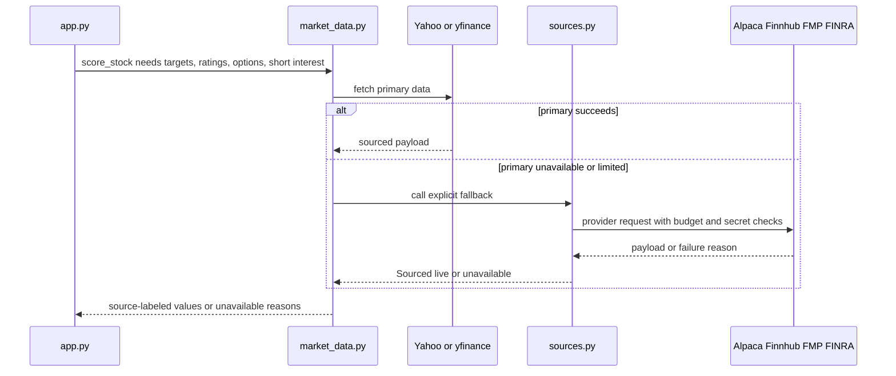

# Provider Failover Layer

`sources.py` is the non-Yahoo provider adapter layer used by `market_data.py` and `app.py`. Yahoo remains primary where it defines the product or supplies richer batched data, but every important data family has an explicit fallback or an explicit unavailable state. This page focuses on provider relationships; the cache and warmer mechanics are covered in [Market Data Cache and Warmers](market-data-cache-and-warmers.md).

## Provider ordering principles

The repository encodes two ordering rules in `sources.py` and the README:

1. Spend abundant request budgets before scarce ones. Finnhub and Alpaca are used before FMP where their data is equivalent because FMP has an in-code hard stop of `FMP_DAILY_BUDGET = 200` under a 250/day plan.
2. Prefer official APIs over scraping when data quality is equal. Yahoo keeps first place for the daily-losers product definition, batched chart/history calls, bundled quoteSummary fields, and options open interest.

## Provider capability matrix

| Data family | Primary path | Backup path | Owning code | Important caveat |
| --- | --- | --- | --- | --- |
| Losers universe | Yahoo screener in `app.scrape_yahoo_losers()` | `sources.alpaca_losers()`, then `sources.fmp_losers()` | `app.stable_universe()` and `sources._normalize_loser_rows()` | Failover rows are filtered for sub-dollar paper, warrants/units, and dotted classes. |
| Latest quotes | Yahoo chart or batched yfinance history | `sources.latest_trades()`, then `sources.quote_failover()` via Alpaca, Finnhub, FMP | `app.get_stock_details()`, `market_data.refresh_last_bar()` | Alpaca IEX can patch only same-session cached bars. |
| Price history and technicals | yfinance history and `yf.download()` | Alpaca IEX bars, then FMP EOD bars | `market_data.technicals()`, `batch_history()` | Alpaca IEX volume is not consolidated; source labels disclose it. When all paths fail, `market_data.technicals()` calls `sources._compose_failure()` so the caller sees the primary Yahoo cause plus the Alpaca/FMP fallback chain. |
| Analyst targets | yfinance `.info` target fields | `sources.price_targets()` from FMP | `market_data.analyst_target()` | Requires at least `MIN_ANALYSTS_FOR_CONSENSUS = 3`. |
| Analyst rating spread | Finnhub recommendation trends | yfinance recommendations | `market_data.analyst_recommendations()`, `sources.ratings_spread()` | Failures preserve provider identity so outages are not cached as `no ratings`. |
| Analyst revision chip | FMP grade events | Finnhub monthly trend | `sources.analyst_grades()` and `app.calculate_enhanced_investment_analysis()` | FMP is first because per-firm events exist only there. |
| Earnings | Finnhub calendar | FMP calendar, Yahoo estimated window in `market_data.earnings_date()` | `sources.earnings_confirmed()`, `app._earnings_in_window()` | API-side symbol filters are not trusted; code filters rows by symbol. |
| Options positioning | yfinance option chain | Alpaca indicative options snapshots | `market_data.options_flow()`, `sources.options_putcall()` | Yahoo option refusals arm a shared cooldown before fallback. |
| Implied move | yfinance ATM straddle | Alpaca indicative straddle | `market_data.implied_move()`, `sources.implied_straddle_move()` | Needs a real cached spot and one shared strike on both call and put sides. |
| Short percent of float | yfinance shortPercentOfFloat | FINRA consolidated short interest over FMP float | `market_data.profile()`, `sources.short_percent_float()` | Derived value is bounded to plausible 0 to 150 percent of float. |
| Headlines | Finnhub company-news | yfinance news | `market_data.headlines()`, `sources.company_news()` | No headlines is distinct from provider failure. |
| Sector/industry | yfinance `.info` | Finnhub profile2 for name/industry only | `market_data.profile()`, `sources.company_profile()` | Finnhub profile2 does not fill GICS sector. |
| Trading calendar | Alpaca calendar | Weekday fallback when unavailable | `sources.trading_days_set()`, `market_data.market_phase()` | Hot path uses `cache_only=True` to avoid fetches. |
| Splits | Alpaca corporate actions | FMP splits | `sources.splits_for()`, `tracking._split_factor_between()` | Used to correct implausible split-affected track-record returns. |
| Macro | Federal Reserve FOMC page and FRED releases/series | Explicit unavailable | `econ_calendar.py`, `market_data.fred_latest()` | FRED needs `FRED_API_KEY`; FOMC needs no key. |
| SEC filings and fundamentals | SEC EDGAR | Explicit unavailable | `market_data.insider_filings()`, `sec_fundamentals()`, `solvency()` | EDGAR access uses `EDGAR_USER_AGENT`. |

## Credential access and secret hygiene

`sources.py`, `social.py`, `econ_calendar.py`, and `market_data.py` obtain credentials through `secrets_store.get()`. `secrets_store.py` checks environment variables first, then the macOS Keychain only on Darwin hosts. `secrets_store.status()` reports whether a credential exists without returning its value.

Provider keys are optional unless a feature depends on that provider:

- `ALPACA_API_KEY` and `ALPACA_API_SECRET` unlock Alpaca data and the paper trading account.
- `FINNHUB_API_KEY` unlocks ratings, earnings, news, and profile2 fallbacks.
- `FMP_API_KEY` unlocks FMP losers, price targets, grades, earnings, float, splits, EOD history, and delisted companies.
- `FRED_API_KEY` unlocks FRED release dates and FRED series values.
- `REDDIT_CLIENT_ID` and `REDDIT_CLIENT_SECRET` unlock Reddit search sentiment.
- `LIVE_ALPACA_API_KEY`, `LIVE_ALPACA_API_SECRET`, and `LIVE_TRADING_ARMED` are covered in [Paper Trading and Live Gate](../trading/paper-trading-and-live-gate.md).

`provenance.redact_secrets()` strips `apikey=` and `token=` query parameters from provider-originated exception text before errors can be logged, cached, or displayed.

## Budget and idempotency controls

FMP-backed calls are guarded by `_fmp_budget_ok()`. With Redis, the counter uses an atomic `INCR` key under the market-data cache schema; without Redis, each process has a local cap of half the global budget so two workers still stay below the plan limit. Day-stamped scarce calls such as `price_targets()`, `shares_float()`, `short_percent_float()`, and `fmp_eod_bars()` use `TTLCache.claim_once()` plus an answer replay key so concurrent callers do not spend the same per-symbol-per-day request twice (cross-process only when Redis backs the cache; the local fallback's claim and replay are per-process).

Alpaca paper trading uses deterministic `client_order_id` values for idempotency. Duplicate order IDs are interpreted as already submitted rather than retried into duplicate positions.

## Fallback flow example



This sequence is the common pattern behind target, rating, options, price, and short-interest fallbacks.

## Tests and validation

Focused tests live mostly in `tests/test_sources.py`:

- `TestProviderPrinciples.test_universe_prefers_alpaca_over_fmp` and `test_ratings_finnhub_first_yahoo_never_touched` prove provider ordering.
- `TestFactorBackups.test_options_falls_back_on_chain_stage_failure` proves fallback engagement after an options chain-stage Yahoo failure.
- `TestFactorBackups` also exercises day-claim replay for target and short-interest backups.
- `TestFactorBackups.test_putcall_refuses_past_page_budget` checks `_alpaca_option_snapshots()` refuses partial option chains with a page-budget reason.
- `TestTechnicalsFailover.test_alpaca_bars_serve_when_yahoo_dies` proves Yahoo-to-Alpaca technical-history fallback.
- `TestHistoryThirdString.test_all_providers_down_reports_the_chain` proves combined Yahoo/Alpaca/FMP failure details are surfaced.
- `TestSecretRedaction.test_fmp_http_error_cannot_leak_the_key` proves provider error redaction.
- `TestPaperGuard` verifies paper endpoint pinning and live endpoint refusal.
- `TestFmpBudget` verifies FMP daily budget increment and stop behavior.
- `TestLosersFailover` verifies losers failover shape and `app.stable_universe()` fallback behavior.
- `TestGrades`, `TestEarnings`, and `TestSplits` cover grades, earnings, and split fallbacks.
- `TestPriceFailover` verifies same-session price failover patching.

Related tests:

- `tests/test_no_fabrication.py` covers secret-safe and missing-data behavior.
- `tests/test_market_context.py` covers options/implied-move and EDGAR failure cases.
- `tests/test_gold_standard.py` covers Form 4 and XBRL source logic.

Minimal validation after provider changes:

```bash
python -m pytest tests/test_sources.py tests/test_no_fabrication.py -q
```
