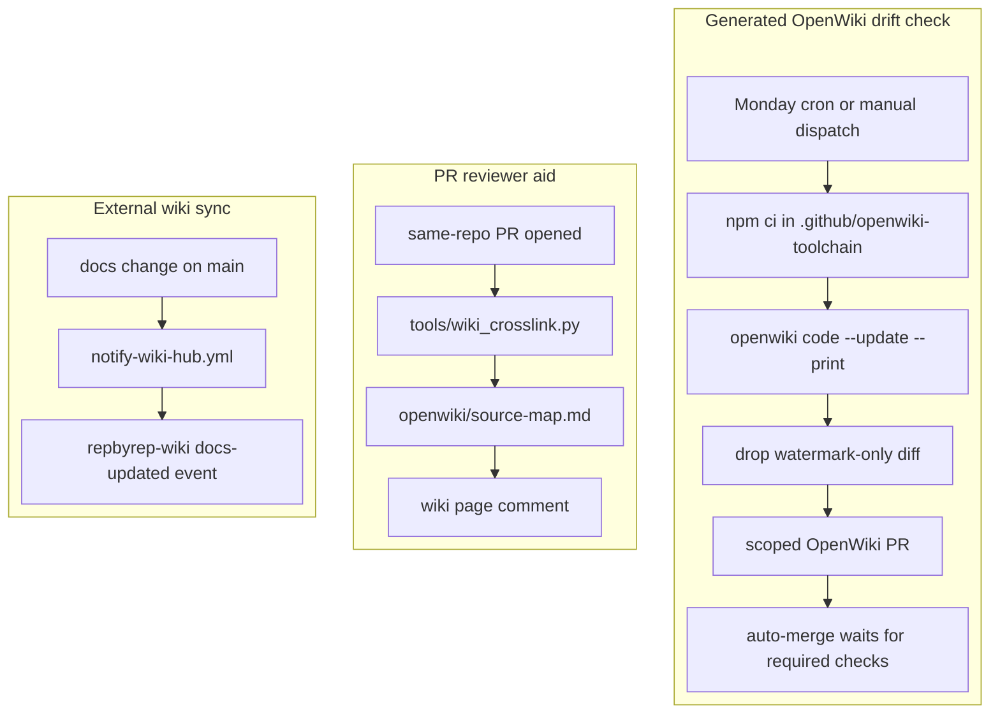

# Deployment and Observability

The app deploys as a Python Flask service behind Gunicorn. Redis is optional but important for shared cache and coordination across workers. NGINX, Docker Compose, and Kubernetes manifests provide scaling examples, while GitHub Actions enforce tests, audits, source-health monitoring, and nightly snapshot capture.

Configuration and credentials are documented in [Configuration and Secrets](configuration-and-secrets.md).

## Runtime entrypoints

| File | Role |
| --- | --- |
| `Procfile` | Platform shorthand: `web: gunicorn app:app`. |
| `Dockerfile` | Builds Python 3.9 slim image, installs dependencies, copies repo, switches to non-root `appuser`, exposes `8080`, and starts `gunicorn -c gunicorn.conf.py app:app`. |
| `gunicorn.conf.py` | Production process settings: `gthread`, 2 workers, 4 threads, 120-second timeout, `preload_app = True`, stdout logs, `/dev/shm` worker temp directory. |
| `app.py` | Flask app object and all route registration. |

Because Gunicorn preloads the app, background threads are intentionally started from `app._ensure_warmer_running()` after fork, not during import.

## Local and container topology

`docker-compose.yml` defines:

- `redis`: `redis:7-alpine`, persistent volume, healthcheck.
- `app`: built from the local Dockerfile, `REDIS_URL=redis://redis:6379/0`, `PORT=8080`, healthcheck against `/health`, exposes 8080 only inside the compose network.
- `nginx`: `nginx:alpine`, ports 80/443, mounts `nginx.conf`, proxies to app.
- `prometheus`: optional metrics collection service, but the referenced `prometheus.yml` is not present in the repository inventory, so treat it as a deployment-local requirement.

`docker-compose.scale.yml` adds an example 3-replica app deployment and cAdvisor. It references `nginx.scale.conf`, which is not present in this repository, so use it as a guide rather than an immediately runnable compose overlay unless that file is supplied.

## NGINX behavior

`nginx.conf` defines:

- `least_conn` upstream to `app:8080`.
- `/health` bypasses rate limiting.
- `/api/` is limited by `limit_req zone=api burst=20 nodelay` and has 60-second proxy read/send timeouts.
- Static assets receive one-year immutable caching.
- `/` uses the `general` limit zone with `burst=50`.
- `/metrics` is restricted to loopback and private network ranges.
- Security headers mirror core browser hardening in Flask.

## Kubernetes manifest

`k8s-deployment.yaml` contains:

- `Deployment` named `yahoo-losers-webapp`, 2 initial replicas, container port 8080, resource requests `100Mi`/`100m`, limits `200Mi`/`500m`.
- HTTP readiness probe on `/health` and liveness probe on `/health`.
- `Service` named `yahoo-losers-service` of type `LoadBalancer`.
- `HorizontalPodAutoscaler` from 2 to 10 replicas, targeting 70 percent CPU and 80 percent memory.
- Redis Deployment and Redis Service named `redis-service`.

The app reports cache backend and memory in `/health`, so Kubernetes liveness/readiness can observe resource stress without requiring providers to be warm.

## Health and metrics endpoints

| Endpoint | Purpose | Operational interpretation |
| --- | --- | --- |
| `/health` | Liveness and basic resource status. | Empty cache is normal and not unhealthy. Memory percent above 90 changes status to unhealthy. Includes page cache backend, market-data backend, and entry count. |
| `/health/sources` | Provider reachability and yfinance rate-limit signal. | Returns `207` when one or more sources are degraded. Used by scheduled health-watch. |
| `/metrics` | Memory and page-cache state. | Restricted by NGINX to private network ranges. |
| `/refresh` | Manual page and market-data cache clear. | Clears Redis/file rendered cache and `market_data` cache; next request rebuilds. |
| `/api/client-error` | Browser error telemetry. | Stores last 50 entries in-process only. |
| `/api/client-errors` | Read browser error buffer. | Non-durable, per-worker view. |
| `/api/tasks/start/<symbol>` and `/api/tasks/status/<task_id>` | Celery task scaffolding. | Requires Redis broker to work usefully; current task bodies return placeholder pending payloads. |

## GitHub Actions

| Workflow | Purpose |
| --- | --- |
| `.github/workflows/tests.yml` | Installs runtime and dev requirements, runs `python -m pytest tests/ -q`, and greps for known fabricated fallback patterns and bare `except:` in `app.py`. |
| `.github/workflows/audit.yml` | Runs `pip-audit` on the resolved runtime environment on PRs, pushes to main, and weekly. |
| `.github/workflows/gitleaks.yml` | Required secret-scanning gate over full git history. The workflow downloads the pinned `gitleaks` v8.30.1 Linux binary, verifies the tarball SHA-256, and runs `/tmp/gitleaks git . --no-banner --redact`; it complements runtime payload scrubbing in [Data Provenance and No-Fabrication Contract](../data/provenance-and-honesty.md). |
| `.github/workflows/lint.yml` | Required `ruff`, `markdownlint`, and `wiki-facts` gates. `wiki-facts` runs `tools/check_wiki_facts.py`, which compares source constants, workflow job IDs, README discipline, and generated or authored documentation claims. |
| `.github/workflows/snapshot.yml` | Calls `/api/snapshot`, validates nonempty scored snapshot, commits `data/snapshots/<date>.json`, and posts a daily digest issue with top scores and paper events. |
| `.github/workflows/healthwatch.yml` | Probes `/health/sources` every 30 minutes, opens a provider-degraded issue, and closes it when healthy. |
| `.github/workflows/openwiki-update.yml` | Generated OpenWiki maintenance automation: runs `openwiki code --update --print` on Monday mornings UTC and by manual dispatch using the pinned `.github/openwiki-toolchain` package, suppresses watermark-only diffs, opens a scoped PR with `OPENWIKI_PUSH_TOKEN`, and arms auto-merge for the generated-docs lane. |
| `.github/workflows/wiki-crosslink.yml` | On same-repository PR open, runs `tools/wiki_crosslink.py` to comment which `openwiki/` pages cover the changed files by reverse-mapping `openwiki/source-map.md`. Fork PRs are skipped to avoid a write-token path. |
| `.github/workflows/notify-wiki-hub.yml` | On pushes to `main` that touch `openwiki/**`, `docs/**`, legacy `wiki/**`, README, AGENTS, or CLAUDE, dispatches `docs-updated` to `repbyrep-wiki` so the external hub can rebuild before its nightly backstop. |

## Documentation automation notes

The generated `openwiki/` tree is maintained by `.github/workflows/openwiki-update.yml`; the hand-authored [Authored docs](../../docs/doctrine.md) are a separate doctrine layer and should be linked rather than duplicated. `openwiki/INSTRUCTIONS.md` is the user-authored standing brief that steers future generated updates, while `.github/openwiki-toolchain/package.json` pins `openwiki`, `mermaid`, and `jsdom` for reproducible documentation and diagram validation. `.markdownlint-cli2.yaml` keeps generated `openwiki/**` exempt while re-including the authored standing brief for markdown linting.



This diagram shows the three documentation-delivery workflows: generated OpenWiki drift repair, deterministic PR cross-linking, and post-merge hub notification.

## Operational failure modes

- Redis unavailable: page cache falls back to file cache, market-data cache falls back to memory, worker coordination is weaker, and provider calls may be duplicated across workers.
- Provider rate limits: Yahoo `.info` backs off through the adaptive info lane; options endpoint uses a shared cooldown; FMP calls are hard-budgeted.
- Warmers disabled: tests set `MARKET_DATA_DISABLE_WARMER=1`; production without warmers will serve more cold `—` values and slower detail fetches.
- Missing provider keys: optional features return unavailable states instead of guessed data; provider failure details are scrubbed at the `market_data._cached()` boundary with `provenance.redact_secrets()` before they can persist in cache-backed UI or API payloads.
- Source health degradation: `/health/sources` and the health-watch workflow surface degraded upstreams before the dashboard silently loses factors.

## Validation commands

Typical local checks:

```bash
python -m pytest tests/ -q
python -m pytest tests/test_sources.py tests/test_freshness.py -q
python -m pytest tests/test_live_gate.py -q
```

For generated-documentation automation changes, choose the narrowest check for the touched boundary:

```bash
python -m pytest tests/test_wiki_crosslink.py -q
python3 tools/check_wiki_facts.py
npx markdownlint-cli2 openwiki/INSTRUCTIONS.md
```

Use `tests/test_wiki_crosslink.py` when changing `tools/wiki_crosslink.py` or `.github/workflows/wiki-crosslink.yml`; use `tools/check_wiki_facts.py` when changing documented constants, required-check naming, README discipline, or the generated-docs gate; use markdownlint when the authored standing brief changes.

Container smoke check:

```bash
docker build -t yahoo-losers-webapp .
container_id=$(docker run -d --rm -p 8080:8080 yahoo-losers-webapp)
trap 'docker stop "$container_id" >/dev/null' EXIT
curl --fail --retry 10 --retry-delay 1 http://localhost:8080/health
```
