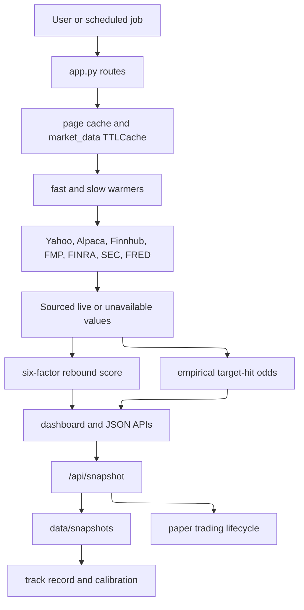

# OpenWiki Quickstart

This repository is a Flask web app that builds a daily Yahoo Finance losers board, enriches each symbol with source-labeled market data, scores mean-reversion setup quality, displays empirical target-hit odds, records daily snapshots, and optionally exercises a strictly gated Alpaca paper-trading workflow.

Start with the map below, then use the routing table to jump from a change intent to the relevant source, wiki page, and tests.

## Main concepts

- [Architecture Overview](architecture/overview.md): whole-system map and request/data/trading flows.
- [Authored docs](../docs/doctrine.md): separate hand-authored doctrine and design-rationale layer; link to it when explaining product judgment rather than duplicating it here.
- [Dashboard and Routes](application/dashboard-and-routes.md): Flask routes, homepage orchestration, page cache, task endpoints, client-error telemetry, health, exports, and PWA assets.
- [Data Provenance and No-Fabrication Contract](data/provenance-and-honesty.md): `Sourced`, unavailable values, derived labels, secret redaction, and “never invent a number”.
- [Market Data Cache and Warmers](data/market-data-cache-and-warmers.md): Redis/local/disk cache, TTL policy, `_cached()`, yfinance producers, background warm lanes, and latest-bar refresh.
- [Provider Failover](data/provider-failover.md): Yahoo, Alpaca, Finnhub, FMP, FINRA, SEC EDGAR, FRED, Reddit, and StockTwits provider chains and budget rules.
- [Rebound Score and Board Ranking](scoring/rebound-score.md): six-factor score, minimum coverage, confidence, recommendation bands, degraded banners, and composite ordering.
- [Empirical Odds and Timeframes](scoring/empirical-odds-and-timeframes.md): target-hit probabilities, evidence ladder, cohort shrinkage, Wilson intervals, and `/api/sophisticated-timeframe/<symbol>`.
- [Professional Analysis APIs](analysis/professional-analysis-apis.md): social sentiment, news/fall reason, options flow, institutional flow, economic calendar, and aggregate professional analysis.
- [Snapshots, Track Record, and Calibration](tracking/snapshots-track-record-and-calibration.md): `/api/snapshot`, committed history, returns, calibration, live-readiness inputs, and walk-forward reporting.
- [Paper Trading and Live Gate](trading/paper-trading-and-live-gate.md): Alpaca paper entries, lifecycle exits, protective orders, account overview, inspector page, and live-money gate.
- [Backtesting and Walk-Forward Evaluation](evaluation/backtesting-and-walkforward.md): `backtest.py` CLI and `walkforward.py` report-only fitting.
- [Deployment and Observability](operations/deployment-and-observability.md): Docker, Gunicorn, Compose, NGINX, Kubernetes, health/metrics, CI, health-watch, and snapshot automation.
- [Configuration and Secrets](operations/configuration-and-secrets.md): environment variables, defaults, credential lookup precedence, and safety impact.
- [Testing Strategy and Fixtures](testing/strategy-and-fixtures.md): offline pytest structure and focused commands.
- [Source Map](source-map.md): compact code ownership and test routing table.

## System at a glance

The most important invariant is that all financial facts are either source-labeled or explicitly unavailable. Missing data should render as `—` or an unavailable JSON state, not as a guessed neutral number.

## Task routing table

| Change intent | Read first | Source entrypoints and symbols | Focused tests | Minimal validation |
| --- | --- | --- | --- | --- |
| Change the homepage board build | [Dashboard and Routes](application/dashboard-and-routes.md) | `app.index`, `stable_universe`, `get_stock_details`, `calculate_enhanced_investment_analysis`, `filter_ai_recovery_potential`, `save_cache`, `format_results_as_html` | `tests/test_freshness.py`, `tests/test_rank.py`, `tests/test_no_fabrication.py` | `python -m pytest tests/test_freshness.py tests/test_rank.py tests/test_no_fabrication.py -q` |
| Change source/fallback behavior | [Provider Failover](data/provider-failover.md) | `sources._fmp_get`, `_finnhub_get`, `_alpaca_get`, `price_targets`, `ratings_spread`, `options_putcall`, `short_percent_float`, `daily_bars`, `fmp_eod_bars` | `tests/test_sources.py` | `python -m pytest tests/test_sources.py -q` |
| Change cache or background warming | [Market Data Cache and Warmers](data/market-data-cache-and-warmers.md) | `market_data.TTLCache`, `_cached`, `_effective_ttl`, `request_warm`, `_warm_loop`, `_info_loop`, `_holds_warm_lease`, `batch_history`, `refresh_last_bar` | `tests/test_freshness.py`, `tests/test_no_fabrication.py`, `tests/test_sources.py` | `python -m pytest tests/test_freshness.py tests/test_no_fabrication.py tests/test_sources.py -q` |
| Change score calculation | [Rebound Score and Board Ranking](scoring/rebound-score.md) | `recommendation.WEIGHTS`, `score_rebound`, factor scoring helpers, `app.score_stock`, `SENTIMENT_BANDS` | `tests/test_no_fabrication.py`, `tests/test_rank.py` | `python -m pytest tests/test_no_fabrication.py tests/test_rank.py -q` |
| Change probability/timeframe logic | [Empirical Odds and Timeframes](scoring/empirical-odds-and-timeframes.md) | `timeframes.hit_rate`, `best_hit_rate`, `annotate_targets`, `app._evidence_bases`, `_horizon_summaries`, `_attach_empirical_probabilities`, `SophisticatedTimeframePredictor` | `tests/test_odds_engine.py`, `tests/test_polish.py`, `tests/test_freshness.py` | `python -m pytest tests/test_odds_engine.py tests/test_polish.py tests/test_freshness.py -q` |
| Change professional APIs | [Professional Analysis APIs](analysis/professional-analysis-apis.md) | `analyze_social_sentiment`, `analyze_stock_news`, `analyze_options_flow`, `track_institutional_flow`, `get_economic_calendar_impact` | `tests/test_no_fabrication.py`, `tests/test_market_context.py`, `tests/test_gold_standard.py` | `python -m pytest tests/test_no_fabrication.py tests/test_market_context.py tests/test_gold_standard.py -q` |
| Change snapshots or track record | [Snapshots, Track Record, and Calibration](tracking/snapshots-track-record-and-calibration.md) | `app.api_snapshot`, `tracking.build_snapshot`, `tracked_symbols`, `compute_track_record`, `compute_calibration`, `live_readiness` | `tests/test_polish.py`, `tests/test_gold_standard.py`, `tests/test_live_gate.py` | `python -m pytest tests/test_polish.py tests/test_gold_standard.py tests/test_live_gate.py -q` |
| Change paper-trading behavior | [Paper Trading and Live Gate](trading/paper-trading-and-live-gate.md) | `sources.paper_execute_picks`, `paper_manage_positions`, `_alpaca_trading_base`, `_alpaca_trading_context`, `_sessions_between`, `paper_account_overview` | `tests/test_sources.py`, `tests/test_live_gate.py` | `python -m pytest tests/test_sources.py tests/test_live_gate.py -q` |
| Change CLI evaluation | [Backtesting and Walk-Forward Evaluation](evaluation/backtesting-and-walkforward.md) | `backtest.run`, `backtest.main`, `walkforward.walk_forward`, `walkforward._training_rows` | `tests/test_gold_standard.py`, `tests/test_polish.py` | `python -m pytest tests/test_gold_standard.py tests/test_polish.py -q` |
| Change deployment/config/secrets | [Deployment and Observability](operations/deployment-and-observability.md), [Configuration and Secrets](operations/configuration-and-secrets.md) | `Dockerfile`, `gunicorn.conf.py`, `docker-compose.yml`, `nginx.conf`, `k8s-deployment.yaml`, `secrets_store.get`, env constants | `tests/test_no_fabrication.py`, `tests/test_sources.py`, `tests/test_live_gate.py` | `python -m pytest tests/ -q` plus container smoke if runtime files changed |
| Change generated-documentation automation, standing corrections, or docs gates | [Deployment and Observability](operations/deployment-and-observability.md), [Testing Strategy and Fixtures](testing/strategy-and-fixtures.md), [Source Map](source-map.md) | `.github/workflows/openwiki-update.yml`, `.github/openwiki-toolchain/package.json`, `.github/workflows/wiki-crosslink.yml`, `tools/wiki_crosslink.py`, `tools/check_wiki_facts.py`, `.github/workflows/notify-wiki-hub.yml`, `openwiki/INSTRUCTIONS.md`, `AGENTS.md` OPENWIKI block | `tests/test_wiki_crosslink.py`; deterministic `wiki-facts`; markdownlint for the authored brief | `python -m pytest tests/test_wiki_crosslink.py -q` for cross-linker changes; `python3 tools/check_wiki_facts.py` for facts-gate changes; `npx markdownlint-cli2 openwiki/INSTRUCTIONS.md` when the authored brief changes |

## High-risk invariants before editing

- Do not replace missing provider data with constants, neutral scores, inferred dates, synthetic target prices, or zero counts unless zero is the observed value.
- Preserve `Sourced` source and reason information through UI/API payloads.
- Keep render paths cache-first or cache-only for slow providers; use warmers for expensive or rate-limit-prone work.
- Keep FMP calls budgeted and per-symbol-per-day idempotent.
- Keep Yahoo `.info` and options endpoints paced and cooled down after refusals.
- Do not allow live trading unless the exact arming phrase, live credentials, and `tracking.live_readiness()` all pass.
- When grading model claims, use what the app actually published, not a later reconstruction.

## Backlog and valid deferrals

- No source-grounded deferrals were made for substantial modules or route families. `docker-compose.scale.yml` references `nginx.scale.conf`, and `docker-compose.yml` references `prometheus.yml`; those files are not present in the repository inventory, so the wiki documents the references as deployment-local requirements rather than inventing their contents.
