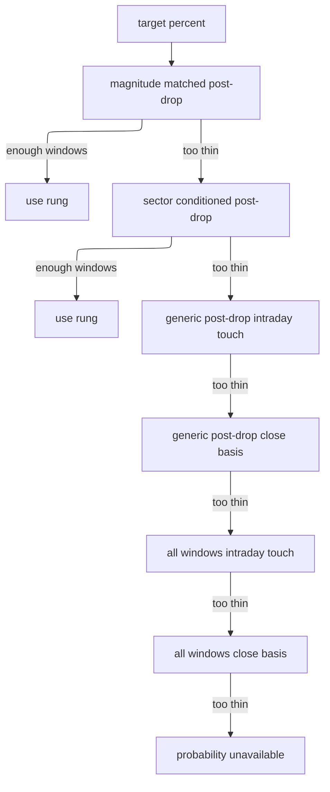

# Empirical Odds and Timeframes

The app has two layers for recovery targets:

- `sophisticated_timeframe.py` builds short- and medium-term target levels and auxiliary signals from market data.
- `timeframes.py` and `app._attach_empirical_probabilities()` replace invented probabilities with historical hit-rate measurements.

The production goal is not to say “this will happen”; it is to state exactly which historical question was measured, with denominators and uncertainty.

## Core probability engine

`timeframes.py` owns the reusable math:

| Symbol | Purpose |
| --- | --- |
| `HORIZON_BARS` | Maps `short`, `medium`, `long` to 7, 21, and 126 trading bars. |
| `day_drop_mask()` | Selects windows that started after a close-to-close decline of at least `SETUP_DROP_PCT`, optionally bounded by drop magnitude. |
| `same_day_return_mask()` | Aligns a reference series such as a sector ETF by date and selects windows where the reference return is inside a band. |
| `rsi_series()` and `oversold_mask()` | Compute Wilder RSI and select oversold start dates. |
| `hit_rate()` | Counts windows that touched a target within a horizon, optionally using intraday highs and recency weighting. |
| `best_hit_rate()` | Walks an evidence ladder and returns the first adequate sample. |
| `target_probability()` | Simple public wrapper for one target and one band. |
| `wilson_interval()` | Computes a 95% Wilson interval over effective evidence. |
| `horizon_distribution()` | Reports p10, median, and p90 forward returns at a horizon. |
| `describe()` | Creates human-readable evidence strings including conditioning and recency notes. |
| `annotate_targets()` | Adds measured probability, interval, evidence, expected value, and miss shape to target dictionaries. |

`MIN_WINDOWS = 40` and `MIN_WINDOWS_CONDITIONAL = 25` prevent very thin samples from being promoted as probabilities.

## Hit-rate semantics

`hit_rate(closes, target_pct, horizon_bars, mask=None, highs=None)` evaluates every valid start window. A hit means the target was reached at any time inside the window. If a `highs` array is aligned with closes, intraday highs are used for touch measurement; otherwise close-only measurement is used and labeled as such.

The function returns raw `hits` and `windows`, a recency-weighted `probability`, `n_eff`, `median_days_to_hit`, `miss_median_return`, `expected_value`, `horizon_bars`, and `touch_basis`. It returns `None` when there is not enough history.

## Evidence ladder for board odds

`app._evidence_bases(symbol, closes)` builds best-to-worst basis candidates for `_horizon_summaries()` and `_attach_empirical_probabilities()`:

1. Magnitude-matched post-drop windows when today's drop is large enough.
2. Sector-conditioned post-drop windows when cached sector ETF data can classify the selloff as sector-wide or company-specific.
3. Generic post-drop windows using intraday highs when 1-year OHLCV is warm.
4. Generic post-drop close-basis windows.
5. Unconditional intraday-high windows.
6. Unconditional close-basis windows.

The first adequate rung wins. Its label is included in the evidence string so users know whether a displayed probability is based on “post-drop”, “sector also down”, “all windows”, or another condition.



This diagram shows how the odds engine chooses the most relevant adequate evidence sample.

## Cohort shrinkage and uncertainty

`app._cohort_prior(band, upside_pct, exclude_symbol=None)` computes a prior across up to 30 symbols in today's losers universe for the nearest `COHORT_BUCKETS` target bucket. It excludes the subject symbol from its own prior. If fewer than five usable histories exist, it returns `None` and no shrinkage is applied.

`timeframes.annotate_targets()` can use this prior to shrink thin recency-weighted probabilities with `shrink_toward_rate()`. When the displayed probability differs from the raw rate after rounding, the payload includes `probability_raw` and the evidence text says it was shrunk toward the cohort. Wilson intervals are computed over overlap-adjusted effective evidence, not raw overlapping windows alone.

## Timeframe predictor integration

`SophisticatedTimeframePredictor.predict_recovery_timeframes()` produces target candidates and context:

- Short-term targets: previous close, 5-day high, 10-day moving average, intraday resistance, and gap fill when present.
- Medium-term targets: 20-day moving average, support bounce, P/E-based fair value, and 50-day moving average when valid.
- Context: VIX, SPY trend, historical drawdown recovery patterns, catalysts, technical momentum, sector performance, and enhanced signals such as volume surge, RSI, MFI, MACD histogram, Bollinger squeeze, put/call, and short interest.

`app._sophisticated_cached(symbol)` passes warmed `market_data.ohlcv_frame(symbol)` and cached profile fields into this predictor when possible, then caches populated results for a market-aware 30 minutes or incomplete results for 90 seconds.

## Probability attachment and API behavior

`app._attach_empirical_probabilities()` applies the measured engine to each target in the predictor output:

- If five-year price history is unavailable, all target probabilities are marked `probability_available: false` and any preexisting `probability` field is removed.
- A short-term `modest_bounce` target at +5% is inserted as a realistic comparable rung.
- Targets are annotated through the shared evidence ladder and cohort prior.
- Oversold and VIX-regime conditioned side evidence is appended when adequate.
- Earnings inside a target window is added to the evidence line.
- `forward_distributions` records raw p10/median/p90 outcomes for each horizon.
- `market_implied` adds the options-market implied move from `market_data.implied_move()`.

`/api/sophisticated-timeframe/<symbol>` returns both `prediction` for existing frontend compatibility and `sophisticated_analysis` for detailed consumers. It also adds long-term analyst target candidates from `market_data.analyst_target()` when the predictor does not provide a `long_term` band. The route creates `analyst_consensus` only when `analyst['mean'].ok`, the current price is positive, and mean upside is positive; it creates `analyst_high` and `analyst_low` only under the same positive-upside gate for the corresponding `high` and `low` sourced values. The payload includes analyst count and source for consensus and never computes a synthetic bull-case target. If no real positive-upside analyst fields exist, no long-term band is added. When long-term targets do exist, `timeframes.annotate_targets(..., 'long')` adds measured 126-trading-bar probabilities.

## Relationship to board columns

`app._horizon_summaries()` uses the same evidence ladder to power board columns:

- `P Short`: probability of reaching previous close within 7 trading bars.
- `P Medium`: probability of reaching the cached 20-day moving average within 21 trading bars.
- `P Long`: probability of reaching analyst consensus within 126 trading bars.

Each cell carries `display`, `detail`, `sort`, `upside`, `bars`, `ev`, and `miss` where measurable. `_composite_rank()` consumes the short-horizon `sort` and `miss` values.

## Tests and validation

Focused tests:

- `tests/test_odds_engine.py::TestEvidenceLadder.test_no_adequate_basis_is_none` and `timeframes.target_probability()` tests in `tests/test_no_fabrication.py::TestEmpiricalProbabilities.test_insufficient_history_returns_none_not_a_guess` cover short-history/unavailable behavior.
- `tests/test_odds_engine.py::TestModestRung.test_injected_into_short_band` verifies the injected +5% modest-bounce rung.
- `tests/test_no_fabrication.py::TestRecentIPOs.test_stale_invented_probability_is_removed_when_unavailable` proves stale heuristic probabilities are removed when empirical evidence is unavailable.
- `tests/test_no_fabrication.py::TestRegimeConditioning.test_conditioned_rate_reports_its_bucket` covers VIX-regime evidence reporting.
- `tests/test_odds_engine.py` also covers post-drop masks, RSI masks, intraday-high touch semantics, evidence ladder selection, shrinkage, annotation labels, cohort priors, and earnings-in-window flags.
- `tests/test_freshness.py::TestEvidenceGapDisclosure` verifies recency-weighted rates disclose raw-vs-weighted divergence.
- `tests/test_polish.py::TestRecencyWeighting` and `TestTrueTouchGrading` cover recency weighting and calibration touch grading.
- `tests/test_market_context.py` covers drop-magnitude and sector-conditioning masks.

Minimal validation:

```bash
python -m pytest tests/test_odds_engine.py tests/test_freshness.py tests/test_polish.py tests/test_market_context.py -q
```
