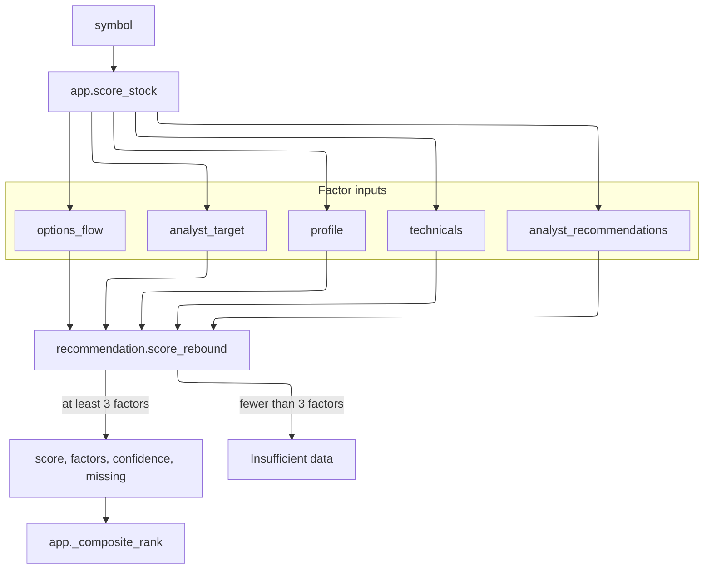

# Rebound Score and Board Ranking

The rebound score ranks how closely a stock resembles historical mean-reversion setups after a selloff. It is implemented in `recommendation.py` and wired into the board through `app.score_stock()`, `calculate_enhanced_investment_analysis()`, and `filter_ai_recovery_potential()`.

It is intentionally **not** a return forecast and not investment advice. Its main safety feature is refusing to score when fewer than three of six factors are available.

## Six-factor model

`recommendation.WEIGHTS` defines nominal weights; `score_rebound()` renormalizes them over only the factors with real data.

| Factor key | Nominal weight | Function | Input source via `app.score_stock()` | Behavior |
| --- | ---: | --- | --- | --- |
| `analyst_upside` | 0.28 | `_score_analyst_upside()` | `market_data.analyst_target()` | Maps consensus upside on a concave curve and damps thin analyst counts toward neutral. |
| `technical_reversion` | 0.24 | `_score_technical_reversion()` | `market_data.technicals()` | Averages Wilder RSI-14, Bollinger `%B`, and gap to 20-day MA. |
| `analyst_ratings` | 0.16 | `_score_analyst_ratings()` | `market_data.analyst_recommendations()` | Converts strongBuy/buy/hold/sell/strongSell into a net posture; strong calls count double. |
| `options_positioning` | 0.14 | `_score_options_positioning()` | `market_data.options_flow()` | Reads put/call ratio contrarian at extremes and near neutral in the middle. |
| `short_interest` | 0.10 | `_score_short_interest()` | `market_data.profile()['short_pct_float']` | Elevated short interest raises squeeze-potential score. |
| `volume_capitulation` | 0.08 | `_score_volume_capitulation()` | `technicals['volume_ratio_20d']` | High volume on the selloff can signal capitulation. |

## Scoring lifecycle



The flow is cache-aware: normal board scoring calls `score_stock(..., full=False)`, so ratings/options and expensive providers are read from warmed caches where possible. Detail or snapshot paths can call with `full=True` to allow fuller network-backed factor collection.

## Missing-data and coverage invariants

`score_rebound()` returns all factor records, including missing factors, but includes only available factors in the weighted score. Important invariants:

- Missing input scores are `None`; they are not scored as 50.
- Below `MIN_FACTORS_FOR_SCORE = 3`, the result is `scored: false`, has no `score`, and recommends `Insufficient data`.
- When scoring succeeds, `coverage = available factors / 6` and `confidence` is `High` at `>= 0.83`, `Moderate` at `>= 0.66`, otherwise `Low`.
- Factor `effective_weight` values sum to approximately 1.0 after renormalization.
- Contributions are sorted descending so `/api/ai-analysis/<symbol>` can report the strongest evidence first.

## Recommendation bands

The score maps to recommendation labels inside `score_rebound()`:

| Score condition | Coverage condition | Label |
| --- | --- | --- |
| `score >= 70` | `coverage >= 0.66` | `Strong rebound setup` |
| `score >= 58` | none beyond scoring threshold | `Constructive` |
| `score >= 45` | none beyond scoring threshold | `Neutral` |
| `score >= 32` | none beyond scoring threshold | `Weak setup` |
| otherwise | none beyond scoring threshold | `Avoid` |

The main table uses `app.SENTIMENT_BANDS` for UI sentiment labels: `Oversold Bounce`, `Constructive`, `Mixed Signals`, and `Weak Setup`. These labels come from the same score so the row label and recommendation list do not diverge.

## Row rendering and contextual chips

`app.calculate_enhanced_investment_analysis()` starts from the legacy price/target rows produced by `calculate_all_investment_analysis()` and attaches the production score. If `score_stock()` returns `scored: true`, the row receives `AI Sentiment` from `SENTIMENT_BANDS`, numeric `Rebound Score`, `Confidence`, `Coverage`, `Factors Used`, `Factors Total`, and `Missing Factor Labels`. If scoring fails or has too few factors, the row is not rendered as a weak bearish score: `AI Sentiment` becomes `⚪ Insufficient data`, `Rebound Score` is `None`, `Confidence` is `None`, and `Score Reason` preserves the refusal reason.

The same row pass attaches non-score context: `_horizon_summaries()` output for `P Short`, `P Medium`, and `P Long`; cache-only `Sector Context`; warmed `Analyst Revisions`; flagged-only `Going Concern`; confirmed/estimated earnings chips; `Liquidity`; and final `Composite` rank.

## Board and recommendation ranking

`app._composite_rank()` orders the board by a stated composite:

```text
0.40 × setup score + 0.35 × 7-day bounce odds + 0.25 × downside shape
```

Inputs:

- `setup`: `Rebound Score / 100`.
- `bounce`: `P Short.sort / 100`, the 7-trading-day empirical hit probability.
- `downside`: transforms the short-horizon miss median return so `0%` is best and `-10%` or worse is worst.

Missing components count as neutral `0.5` instead of renormalizing. This avoids promoting rows only because they lack evidence. `_board_sort_key()` sorts rows with a measurable composite first, then by composite value, then raw rebound score and coverage.

`filter_ai_recovery_potential()` re-scores each candidate and recomputes the composite for the displayed pick payload. This prevents stale composite values from the full-board pass from surviving into the recommendations panel.

## Degraded-state detection

`app.degraded_state()` protects the dashboard from silently treating provider degradation as poor opportunities:

- If the scored share of the board is below `DEGRADED_SCORE_RATIO` (default `0.6`), the page is degraded and cached for at most `DEGRADED_CACHE_SECONDS`.
- If a missing factor appears on at least `SYSTEMIC_MISSING_RATIO = 0.8` of the full board, the banner names the factor and explains that scores are based on fewer inputs.
- The systemic threshold is against the full board, not only the subset that scored.

## Tests and validation

Focused tests:

- `tests/test_no_fabrication.py::TestScoringRefusesToInvent` covers minimum factor count, missing-factor reporting, weight renormalization, contribution arithmetic, damping of thin analyst coverage, and methodology presence.
- `tests/test_rank.py::TestCompositeRank` covers composite formula, neutral imputation, clipping of downside, sorting, and `test_horizon_summaries_surface_ev_and_miss` for EV/miss population in short-horizon cells.
- `tests/test_odds_engine.py` covers unavailable probability cells when history or targets are inadequate.
- `tests/test_rank.py::TestPickCompositeRecompute` verifies recommendation rows recompute composite from fresh score data.
- `tests/test_freshness.py::TestSystemicMissingFactorBanner` covers degraded-board messaging.

Minimal validation:

```bash
python -m pytest tests/test_no_fabrication.py tests/test_rank.py tests/test_freshness.py -q
```
