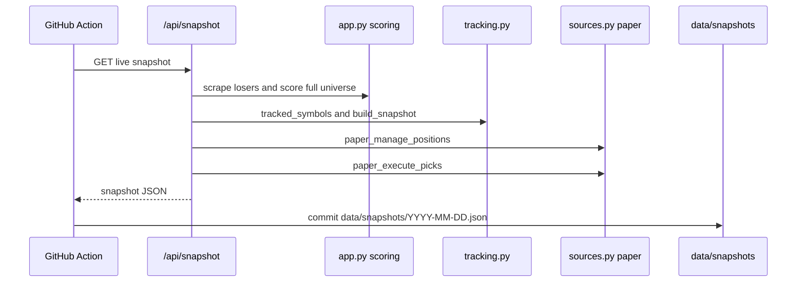

# Snapshots, Track Record, and Calibration

The app's accountability layer is a committed daily snapshot record. `tracking.py` reads and grades those records; `app.api_snapshot()` creates them; `.github/workflows/snapshot.yml` calls the live app after the extended session and commits `data/snapshots/<date>.json`.

This system connects [Empirical Odds and Timeframes](../scoring/empirical-odds-and-timeframes.md), [Rebound Score and Board Ranking](../scoring/rebound-score.md), and [Paper Trading and Live Gate](../trading/paper-trading-and-live-gate.md).

## Snapshot creation

`/api/snapshot` is rate-limited with `MAX_AI_REQUESTS_PER_MINUTE`. It performs a full scoring run for the current losers universe:

1. Calls `scrape_yahoo_losers()` directly for the day's Yahoo-defined universe; if unavailable, returns HTTP 503 rather than recording a blank day.
2. Calls `market_data.batch_history(symbols)` so history, technicals, OHLCV, and cached prices are available.
3. For each symbol, calls `score_stock(symbol, full=True)` to allow full factor fetching.
4. Records price, score, confidence, coverage, factor details, analyst target mean/count, sector, board probabilities, implied move, going-concern flag, and sophisticated modal probabilities.
5. Adds prior tracked symbols from `tracking.tracked_symbols()` plus `SPY` and `^VIX` to `tracked_prices` so future returns remain computable after a stock leaves the losers list.
6. Calls `tracking.build_snapshot(universe, tracked_prices)`.
7. Runs paper lifecycle first and then paper entries, recording results as `paper_lifecycle`, `paper_orders`, and `paper_fills`.
8. Calls `sources.delisted_recent()` and, when available, stores `delisted_last_year` as a survivorship-bias disclosure count for recently delisted US listings.

The workflow `.github/workflows/snapshot.yml` runs at `15 1 * * 2-6` UTC so it lands after the US extended session. It validates that the snapshot has a date, universe list, and at least one scored row before committing.



## Snapshot schema

`tracking.build_snapshot()` returns:

- `date`: exchange-clock trading date from `trading_date_today()`.
- `generated_at`: UTC timestamp.
- `generated_at_eastern`: human-readable Eastern timestamp.
- `model_version`: `tracking.MODEL_VERSION`.
- `universe`: scored rows supplied by `app.api_snapshot()`.
- `tracked_prices`: price map for previously tracked symbols, `SPY`, and `^VIX`.
- `note`: explains the record is tamper-evident and accumulates validation data.

The repo currently includes JSON snapshots under `data/snapshots/`.

## Track record computation

`tracking.compute_track_record()` loads snapshots in chronological order and computes realized returns for rows with `score >= PICK_SCORE` (`70.0`). It also computes the dead-cat baseline from non-picked losers.

Key details:

- `HORIZONS = (7, 30)` are calendar-day horizons matched to the nearest later snapshot within `±40%` of the horizon.
- Pending picks are counted, not silently dropped.
- `SPY` comparison is included when both entry and exit snapshots have SPY prices; the reported `vs_spy` and aggregate `vs_spy_mean` are excess-return calculations: pick return minus SPY return over the same span.
- Implausible absolute returns above 300 percent trigger `_split_factor_between()`, which uses `sources.splits_for()` to correct split-basis differences; uncorrectable extreme rows are counted as `basis_suspect` and excluded.
- Display is newest-first and capped to keep `/track-record` light.

`/track-record` wraps this with the calibration and walk-forward sections and caches the generated HTML under `page:track-record` in the market-data cache.

## Calibration

`tracking.compute_calibration()` grades the probabilities that the app actually published. It looks at snapshot row `predictions`, selects one representative target per `(symbol, horizon)` per day, and resolves each target as hit/miss/unresolved.

Important invariants:

- The threshold is the `target_price` displayed when available; percent-from-entry is only a fallback for older records.
- Predictions that include `horizon_bars` grade over trading-day windows; older calendar-only records use calendar windows.
- Cached intraday highs are primary because predictions claim target touches.
- A complete high series that covers the window and never touches can finalize a miss even without later snapshot closes.
- Partial high coverage decides nothing; snapshot closes are fallback evidence only.
- The threshold can be rebased for corporate-action-scale changes between raw snapshot close and adjusted OHLCV series.
- Outputs include resolved/unresolved counts, high-graded count, Brier score, and calibration buckets.

## Live readiness gate

`tracking.live_readiness()` computes whether the record has earned live-money eligibility. It requires:

- `LIVE_MIN_RESOLVED = 100` resolved predictions.
- Brier score at or below `LIVE_MAX_BRIER = 0.20`.
- `LIVE_MIN_GRADED_FILLS = 20` paper fills.
- `LIVE_MIN_SNAPSHOT_DAYS = 28` continuous snapshot-day streak, allowing gaps up to four calendar days for weekends/holidays.

`sources._alpaca_trading_base('live')` calls this gate before returning the live Alpaca endpoint. See [Paper Trading and Live Gate](../trading/paper-trading-and-live-gate.md).

## Walk-forward report

`walkforward.py` is a report-only model evaluation surface. It reads the same snapshots, builds rows of factor scores with resolved 7-day forward returns, fits ridge weights on strictly prior resolved days, and evaluates top-3 fitted picks against an equal-weight top-3 baseline. The live score keeps using hand-chosen `recommendation.WEIGHTS` until a human changes them.

Detailed CLI backtesting is documented in [Backtesting and Walk-Forward Evaluation](../evaluation/backtesting-and-walkforward.md).

## Tests and validation

Focused tests:

- `tests/test_sources.py::TestSplits` verifies split correction in track-record computation.
- `tests/test_polish.py::TestTrueTouchGrading` verifies intraday-high and close-fallback grading semantics.
- `tests/test_gold_standard.py` verifies unresolved predictions stay unresolved without observed prices.
- `tests/test_live_gate.py` verifies live-readiness criteria, continuous streak handling, fill counting, and track-record dependency in live arming.

Minimal validation:

```bash
python -m pytest tests/test_sources.py tests/test_polish.py tests/test_gold_standard.py tests/test_live_gate.py -q
```
