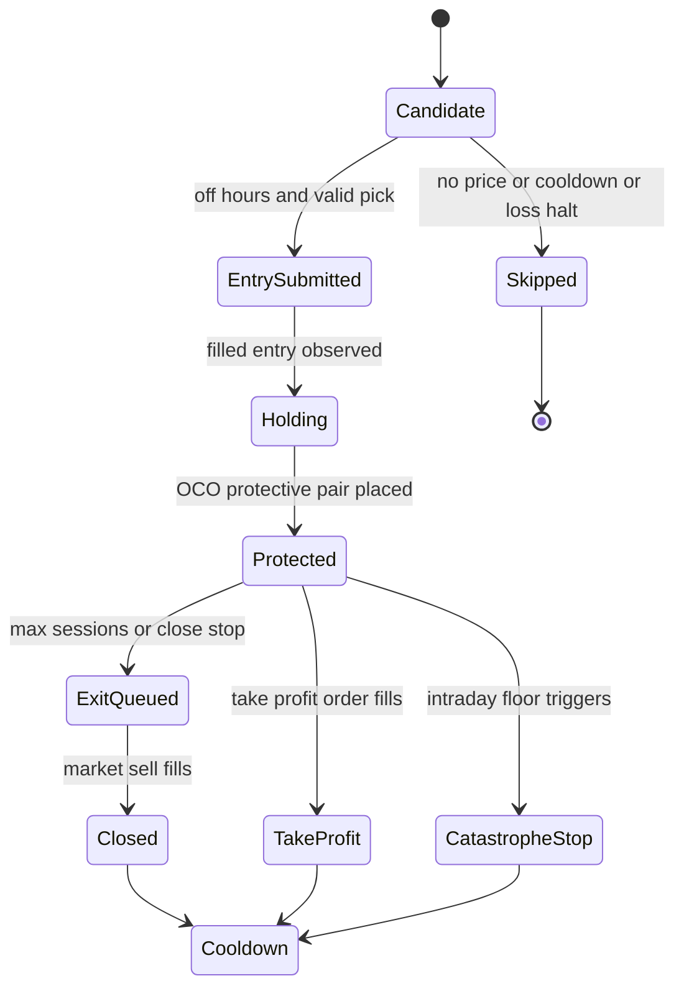

# Paper Trading and Live Gate

The repository includes a paper-trading workflow inside `sources.py`. It is invoked by `app.api_snapshot()` after the daily model snapshot is assembled, and its results become part of the committed snapshot record described in [Snapshots, Track Record, and Calibration](../tracking/snapshots-track-record-and-calibration.md).

The design is conservative: self-serve trading is paper-only. Live trading is unreachable unless a human sets an exact arming phrase, live credentials exist, and `tracking.live_readiness()` says the record has earned it.

## Safety boundary

`_alpaca_trading_base(account='paper')` is the core gate:

- Default and normal path returns `https://paper-api.alpaca.markets`.
- If `ALPACA_PAPER_BASE` is overridden to anything other than the paper endpoint, it raises.
- If `account='live'`, it requires `LIVE_TRADING_ARMED == "yes-i-accept-losses"`.
- It also requires `LIVE_ALPACA_API_KEY` and `LIVE_ALPACA_API_SECRET`.
- It calls `tracking.live_readiness()` and refuses live mode unless every evidence criterion is met.

`_alpaca_trading_context(account)` pairs the chosen base URL with matching credentials, so live base cannot be paired with paper keys.

## Snapshot pick selection

`app.api_snapshot()` builds `qualifying` from snapshot universe rows whose `score` is numeric and `score >= MIN_REBOUND_SCORE`, sorts them descending by score, and passes the full ranked list as `{"symbol", "price"}` dicts to `sources.paper_execute_picks()`. The executor validates each price before consuming a slot and stops only after `PAPER_MAX_PICKS` valid orders, so an unpriceable higher-ranked row cannot crowd out a valid lower-ranked one. Before any new entries, `api_snapshot()` calls `sources.paper_manage_positions()` so exits and protective-order maintenance run before fresh risk is added.

## Paper entry rules

`paper_execute_picks(picks)` submits simulated buy orders for the day's top scored picks.

Constants:

| Constant | Value | Meaning |
| --- | ---: | --- |
| `PAPER_NOTIONAL_PER_PICK` | `1000.0` | Target dollars per pick. |
| `PAPER_MAX_PICKS` | `3` | Maximum entries per snapshot. |
| `PAPER_ENTRY_BAND_PCT` | `2.0` | Limit price is reference price plus 2 percent. |
| `PAPER_DAILY_LOSS_HALT_PCT` | `2.0` | No new entries if paper equity is down at least 2 percent on the day. |
| `PAPER_REENTRY_COOLDOWN_SESSIONS` | `5` | Do not re-enter recently exited names. |

Entry workflow:

1. Refuse during the regular `open` market phase because the intended workflow is after-close decision and next pre-market eligibility.
2. Resolve the paper base and headers.
3. Check account daily-loss halt.
4. Build a recently-exited set from closed `snap-exit-` and `snap-tp-` orders.
5. For each ranked pick, validate symbol and price before consuming a slot.
6. Size whole shares under the notional target.
7. Submit a `buy` limit order with `extended_hours: True`, `time_in_force: "day"`, and deterministic `client_order_id = snap-<date>-<symbol>`.
8. Treat duplicate client-order IDs as already submitted.
9. On provider exceptions, preserve the response body or exception string in the per-symbol `failed` reason so operational debugging does not collapse to only `HTTPError`.

## Position lifecycle

`paper_manage_positions()` runs before new entries in `/api/snapshot`. It manages existing paper positions:

- It refuses during regular market hours so exits queue off-hours for the next open.
- It fetches current positions, open orders, and recent closed orders.
- It reconstructs the reference entry price from the entry order's limit price via `_entry_ref_price()`.
- It computes sessions held with `_sessions_between()`, using the cached Alpaca trading calendar when available and weekday fallback otherwise.
- It exits when `sessions >= PAPER_MAX_SESSIONS` (`PAPER_MAX_SESSIONS` = 7 trading sessions) or the latest close is below `ref * (1 - PAPER_STOP_PCT / 100)` (`PAPER_STOP_PCT` = 8, a close-basis stop 8% under reference).
- Before market exits, it confirms cancellation of resting sell orders so a failed cancel plus new sell cannot double-fill into a short.
- If no protective sell exists, it creates an OCO-style protective pair: take-profit at `ref * (1 + PAPER_TP_PCT / 100)` and catastrophe stop at `ref * (1 - PAPER_CATASTROPHE_STOP_PCT / 100)` (`PAPER_CATASTROPHE_STOP_PCT` = 15, so the broker-resident floor sits 15% under reference).
- Short positions are marked `unexpected-short` and left for manual attention rather than auto-managed.



This state diagram reflects the paper lifecycle constants and order actions in `sources.py`.

## Account overview and recent fills

`paper_account_overview()` is read-only and cached for five minutes. It fetches account, positions, and open orders, then returns equity, cash, day change, positions, and working orders. Position quantities preserve fractional broker-reported values instead of forcing `int()`.

`paper_recent_fills(days=7)` fetches closed orders and records fills with `symbol`, `filled_at`, `filled_avg_price`, `qty`, `side`, and `client_order_id`. `/api/snapshot` adds these fills to the snapshot so slippage and paper execution quality can be evaluated later.

## Inspector page

`/inspect/<symbol>` is a fetch-free route. It sanitizes the path segment to ticker-like characters, finds the most recent recorded predictions for that symbol, reads cached technicals with `allow_fetch=False`, and optionally applies the lifecycle rails to a user-supplied `?basis=`. It can show take-profit reached, close-basis stop breached, catastrophe floor breached, expiry, or inside-window status.

The inspector does not recommend or fetch; it reads recorded history and cached state.

## Live readiness

`tracking.live_readiness()` returns a `ready` boolean and criteria list. Current thresholds are:

| Criterion | Required |
| --- | ---: |
| Resolved predictions | `100` |
| Brier score | `<= 0.20` |
| Graded paper fills | `20` |
| Continuous snapshot days | `28` |

`/track-record` shows this same computed gate through `_graduation_section()`, so the UI cannot claim readiness when `sources.py` would refuse live money.

## Tests and validation

Focused tests:

- `tests/test_sources.py::TestPaperGuard` verifies paper endpoint pinning, whole-share sizing, limit order shape, max-pick cap, and simulated-money basis.
- `tests/test_sources.py::TestPaperWindowFix.test_expensive_stock_still_buys_one_share` covers minimum whole-share sizing.
- `tests/test_sources.py::TestCacheContracts.test_duplicate_retry_keeps_qty_and_ref_price` covers duplicate `client_order_id` retry reporting.
- `tests/test_sources.py::TestPaperLifecycle.test_window_expiry_exits_at_next_open` covers expiry exits; lifecycle tests in that class also cover protective orders and stop behavior.
- `tests/test_sources.py::TestPaperLifecycle.test_blocked_cancel_defers_exit` proves cancel failure blocks exit submission.
- Daily-loss halt and re-entry cooldown behavior are covered in `tests/test_sources.py` assertions around `paper_execute_picks()` that check `daily loss halt` and cooldown refusal reasons.
- `tests/test_live_gate.py::TestLiveArming` verifies unarmed, wrong phrase, missing live keys, unearned record, and successful live-base cases.
- `tests/test_live_gate.py::TestLiveReadiness` verifies empty records, fill counting, and continuous streak semantics.
- `tests/test_live_gate.py::TestInspectorPage` verifies inspector rail states, source/reason rendering, symbol sanitization, and route rate limiting.

Minimal validation:

```bash
python -m pytest tests/test_sources.py tests/test_live_gate.py -q
```
